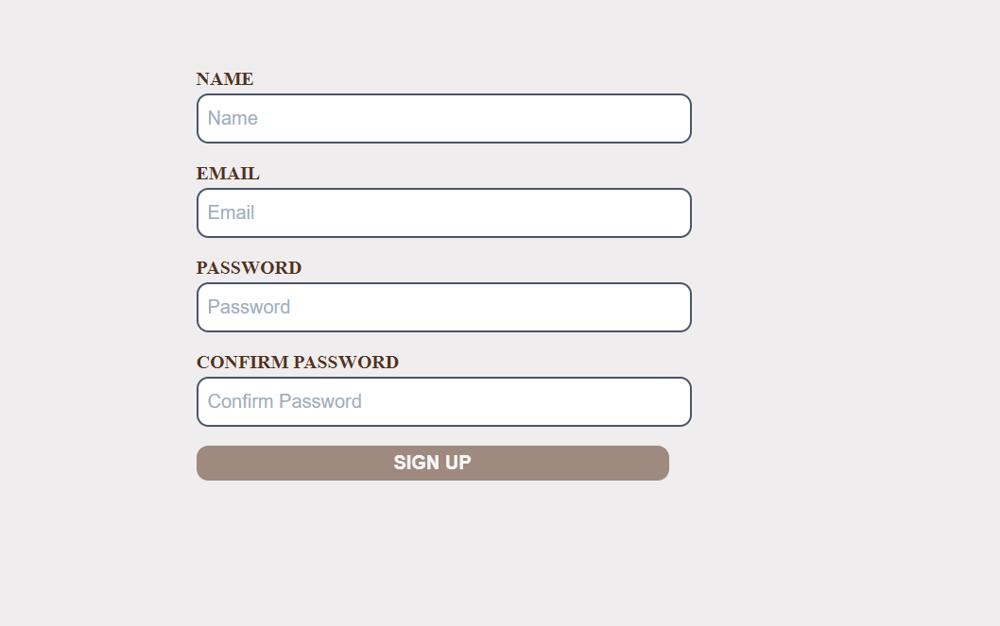
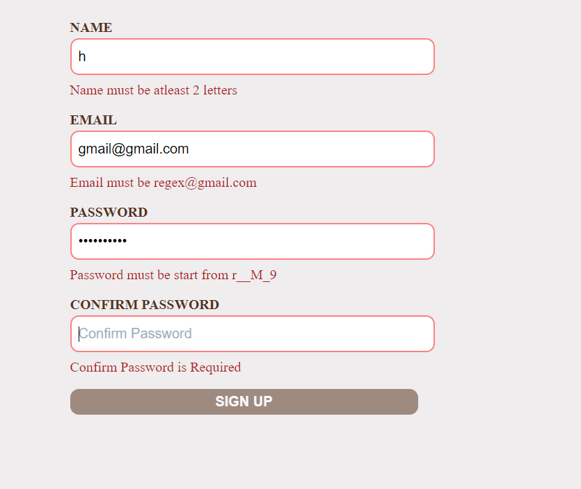

# Login Page with Formic and Yup Libraries

## Overview: 

 - Formik is a popular form library for React that simplifies form management with robust validation, while Yup is a schema validation library used seamlessly with Formik to ensure data integrity and user input validation.
 - I have created a simple login page with validation using both formic and Yup libraries.

## ScreenShots

## :Login Credentials

- name: Any Name
- email: regex@gmail.com
- password: rishiME@199

## Difficulties faced: 

- ### Error Handling in Formik
  
 Managing and displaying error messages based on Formik's validation results, especially for custom validations and dynamic error messages, was challenging.

## How You Overcame It:
- I implemented conditional rendering in the form to display error messages only when the corresponding field had been touched and an error existed. This approach ensured that error messages were shown appropriately and were tailored to the specific validation rules.

### Handling Validation State: 

- Initially, managing the form's validation state and ensuring that the submit button was enabled only when all fields were valid proved challenging.

## How I Overcame it:

### Using isValid and validateOnMount:

 - I utilized Formik’s isValid property to conditionally enable the submit button and set validateOnMount to validate the form when it first loads. This approach ensured the submit button was enabled only when all fields were valid and provided real-time feedback for users.